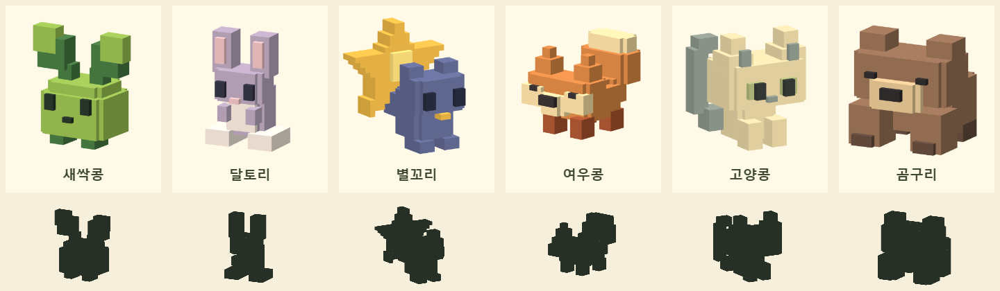

# 첫 여섯 펫 — 24³ 디자인 기준

2026-09-24. 대상은 이름으로 지정된 기존 ID `pet-0`~`pet-5`다. 첫 화면의 이름과 실제 카탈로그를 대조했다. 스테이지 펫 ID 100~319나 보스는 이번에 바꾸지 않는다. 이름·보유 수·등급·성장 수치는 유지한다.



## 제작 전 콘셉트와 실제 구조

| 펫 | 생태·한 줄 콘셉트 | 큰 형태와 과장 비율 | 표정·자세 | 대기 동작 | 색 배분 |
|---|---|---|---|---|---|
| 새싹콩 | 햇빛을 따라 잎을 기울이는 어린 씨앗 | 낮은 씨앗 몸, 두 장의 큰 잎, 작은 뿌리 발 | 넓게 뜬 눈, 위를 살피는 고개 | 두 잎을 번갈아 까딱 | 연두 몸, 짙은 초록 잎 뒷면과 발, 어두운 눈 |
| 달토리 | 귀에 달빛을 모으는 수줍은 토끼 | 좁고 긴 몸, 긴 두 귀, 큰 뒷발, 모은 앞발 | 목을 움츠리고 손을 가슴 앞에 모음 | 귀 움찔 → 살짝 웅크림 | 연보라 몸, 분홍 귀 안쪽, 크림 가슴과 발 |
| 별꼬리 | 꼬리에 밤빛을 저장하는 장난꾸러기 들쥐 | 작은 몸, 짧은 발, 몸보다 넓은 별 부채 | 앞으로 튀어나온 얼굴, 가끔 뒤돌아봄 | 별을 흔들다가 고개를 돌림 | 남색 몸, 금빛 별, 밝은 별 중심 |
| 여우콩 | 낮게 엎드려 바람을 읽는 여우 | 긴 네 발 몸, 넓은 볼, 꺾여 솟은 붓 꼬리 | 좁게 뜬 눈, 돌출 주둥이 | 고개를 살피고 꼬리를 느리게 흔듦 | 주황 몸, 짙은 발, 크림 볼과 꼬리 끝 |
| 고양콩 | 이슬을 건드리려다 멈춘 고양이 | 몸보다 큰 머리, 계단형 삼각 귀, 단단한 몸, 갈고리 꼬리 | 세로 눈동자, 들고 돌리는 고개 | 고개 회전과 꼬리 들어 올리기 | 크림 머리·몸, 회색 귀와 꼬리, 올리브 눈 주변 |
| 곰구리 | 따뜻한 흙을 다독이는 졸음 많은 곰 | 넓은 몸·얼굴, 거대한 앞발, 짧은 뒷다리 | 처진 눈꺼풀과 넓은 주둥이 | 천천히 졸다가 고개를 들고 다시 쉼 | 갈색 몸, 짙은 발끝, 크림 주둥이 |

## 제작 규칙

- 본체는 24×24×24 정수 좌표, 정면 -Z, 좌우 중심 X=11.5. 짝 기관은 `x ↔ 23-x`로 생성한다. 고양콩의 한쪽 갈고리 꼬리와 그 부착 부위만 의도적 비대칭이다.
- 큰 실루엣 3~5개를 먼저 정한다. 동일한 몸통에 귀나 색만 바꾸지 않는다. 이번 여섯은 낮은 씨앗 / 좁은 직립 / 큰 꼬리 / 긴 네 발 / 큰 머리의 앉은 자세 / 넓은 앞발 체형이다.
- 단색의 넓은 면과 한 단계 모서리를 쓴다. 노이즈·랜덤 돌기·표면 색점은 넣지 않는다. 눈은 두 칸 이상의 폭을 확보한다. 여우·곰의 낮은 눈은 졸리거나 능청스러운 표정을 위한 두 칸 폭의 한 칸 높이 형태다.
- 별꼬리의 별은 평면 스티커가 아니라 두께 4칸의 꼬리다. 여우의 꼬리와 고양이의 갈고리는 후면까지 이어지는 입체 기관이다.
- 모델 JSON의 전체 복셀과 리그별 복셀은 동일한 셀 사전에서 분할한다. 기존 greedy mesh를 사용하며 복셀마다 Mesh를 만들지 않는다.
- 머리·눈·귀는 몸의 자식 리그다. 대기 동작은 루트의 월드 위치를 바꾸지 않고 피벗 회전·작은 수축으로 표현한다. 걷는 동안 강도를 낮추고 동작 줄이기 설정에서는 정지한다.
- 모델 24³와 출력 크기는 별개다. 아이콘은 실제 모델로 만든 384px PNG이며 카드에서는 너비에 맞춰 표시한다. 작은 모델에 복셀을 더 넣어 해상도를 높이지 않는다.
- 얼굴과 기관이 같이 보이는 각도를 개별 지정한다. 별꼬리와 고양콩은 반대쪽 3/4를 써 꼬리가 머리 뒤에 숨지 않게 한다. 비교 카드에서는 각 모델의 바운드에 맞춰 같은 비율로 프레이밍한다.

## 도감과 뷰어

`character-gallery.html`은 로컬 파일로도 열 수 있다. 6열 / 3열 / 2열로 반응하며 그림 → 이름 → 접힌 설명 순서다. 첫 6종을 누르면 큰 이미지, 정면·측면·후면·3/4·실루엣, 실제 리그로 렌더링한 24프레임 동작을 확인할 수 있다. 나머지 캐릭터는 기존 검수 시트를 유지한다.

게임 도감에는 여섯 친구의 **미리보기**를 분리해 표시한다. 수집·발견·보상 상태를 바꾸지 않는다. 기존 스테이지 목록은 유지하며 발견한 펫과 보유 펫에서 실제 WebGL 뷰어를 열 수 있다. 뷰어는 한 번에 하나만 만들고 닫을 때 프레임 루프와 렌더러를 해제한다. 정면·측면·후면·3/4, 동작 멈춤, Escape 닫기를 지원한다.

## 수행한 검수와 조정

- 여섯 모델을 같은 224px 카드와 128px 검은 실루엣으로 렌더링해 확인했다. 잎 / 귀 / 별 / 낮은 주둥이와 붓 꼬리 / 큰 머리와 갈고리 / 넓은 앞발로 구별된다.
- 별 경계의 좌우 반올림 차이는 반쪽 좌표를 정확히 복제하도록 수정했다. 고양콩의 꼬리가 머리 셀을 덮던 부분은 뒤로 분리했다. 원래 구도에서 가려지던 고양콩 꼬리는 반대쪽 시점으로 바꿨다.
- 24³ 범위, 대칭 기관, 정확한 리그 분할, 연결된 입체 덩어리, 서로 다른 대기 포즈 검사를 통과했다. 삼각형 수는 300~534개/펫이었다.
- PC Edge의 390×844와 320×700 CSS 뷰포트에서 게임 도감과 확대 뷰어를 확인했다. 가로 넘침 없음, 각도 버튼·동작 정지·Escape 닫기 통과, 브라우저 오류 없음. 휴대폰 실기기 검수는 아니다.
- 갤러리의 1440px 6열 / 390px 2열을 확인했다. 긴 설명은 접히며 카드 이미지가 먼저 보인다. 첫 검수의 이미지 디코딩 전 캡처는 디코딩 완료 후 다시 촬영했다.
- 타입 검사 통과. 전체 게임 회귀·서버 성능 검사는 이번 디자인 검수에 포함하지 않았다.

## 나머지 펫에 확장할 때

먼저 위 표의 체형·주요 기관·표정·대기 동작을 작성하고 이웃한 여섯 캐릭터와 비교한다. 두 마리가 같은 검은 실루엣으로 보이면 색을 고치기 전에 체형을 다시 설계한다. 정면만 통과시키지 않고 측면·후면과 작은 카드도 함께 본다. 희귀도는 작은 노이즈의 양으로 표현하지 않으며 대표 기관의 구조와 움직임으로 표현한다. 현재 ID·저장·희귀도 수치를 그대로 둔다.

원본: `scripts/first_six_pets.py`, 리그 동작: `src/pet-animation.ts`. 이전 전체 생성기를 실행해도 마지막에 첫 여섯의 24³ 원본을 다시 적용한다. 재생성 순서:

```text
python scripts/first_six_pets.py
node scripts/qa/first-six.mjs
python scripts/qa/character-geometry.py --first-six
node scripts/qa/first-six-ui.mjs
```

시각 검수 명령은 사용자가 요청할 때만 실행한다. 첫 여섯의 개별 구도와 고해상도 아이콘은 전용 렌더러가 관리하며 기존 전체 검수 명령은 이를 덮어쓰지 않는다.
