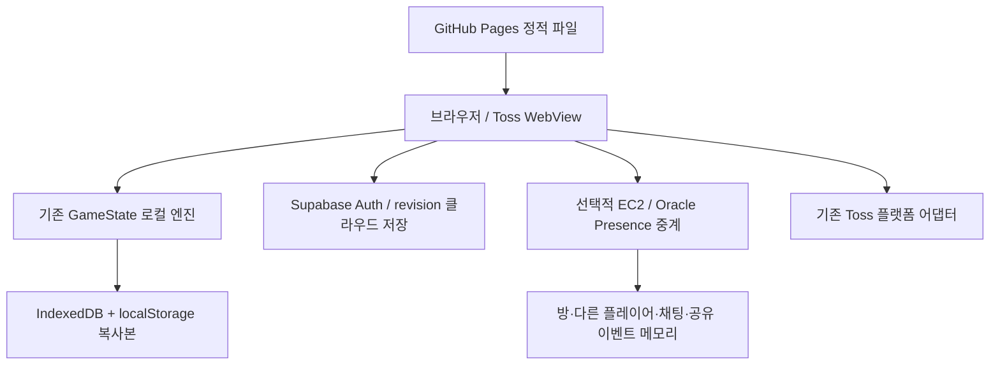

# 로컬 퍼스트 구현 결과와 운영 전환

작성일: 2026-10-03. 저장소 구현과 운영 적용을 구분한다. 새로운 클라이언트와 중계 서버 코드를 구현했으며 운영 EC2 접속·Oracle VM 생성·서버 배포·Supabase SQL 적용은 수행하지 않았다. main 푸시는 기존 GitHub Pages 자동 배포를 트리거한다.

이번 변경은 `refactor/local-first-presence` 브랜치에 커밋·푸시한다. 이 브랜치는 현재 Pages 자동 배포 대상이 아니며 최신 세이브 이관·SQL 적용·중계 배포 확인 후 운영 main으로 전환한다.

## 변경된 아키텍처

GameState의 progression·world와 inventory·pets·economy·settings·runtime 접근자를 사용한다. 기존 Save 형식과 필드는 유지하여 기존 UI·마이그레이션을 재사용한다. 중계 상태는 PresenceClient의 players(peers)·chat·sharedEvents·connection에 따로 보관한다. 렌더러에 필요한 펫·운반 알 정보는 외형 정보이며 소유권이나 보유 목록을 전송하지 않는다.

단계별로 로컬 실행 → 기존 GameState 재사용 → 저장 추가 → 새 중계 추가 순으로 구현했다. 기존 authoritative 엔진은 롤백과 구버전 기록을 위해 남겼으며 새 실행 경로에서 불러오지 않는다. 새 프레임워크와 dependency는 추가하지 않았다.

## 서버에서 제거한 기능

새 기본 중계 서버의 실행 경로에서 다음을 제거했다.

- 일반 플레이 입장 조건과 전체 GameState 시뮬레이션
- 이동 물리·충돌·위치 보정·개인 체력·개인 보스 전투
- 일반 알 소유권·획득 잠금·반납·재생성·부화 처리
- 별가루·펫 보유/장착·상점·판매·강화·성장·개인 보상
- 오프라인 생산·낮/밤 방송·SQLite 진행 저장·Supabase 체크포인트

운영 서버의 기존 프로세스를 실제 교체한 것은 아니다. 기존 room-engine과 SQLite는 삭제하지 않았다.

## 클라이언트로 이동한 기능

기존 GameState가 이동·맵 충돌·개인 보스 이동/접촉/피해/알 낙하·개인 알·수동/자동 부화·부화 수령·별가루·펫·일반 구매/판매·강화·운동·수집 보상·선택 차원 진행을 담당한다. 낮/밤은 신뢰 시계와 기존 deterministic 주기로 계산한다.

기존 자동 부화는 시간 간격을 처리하는 damage/tick 경로를 재사용한다. 서버에 두드리기 요청을 보내지 않는다. 개인 알은 다른 플레이어가 가져가도 사라지지 않는다. 기존 SECRET 외형을 가진 개인 콘텐츠도 자동으로 공유 객체로 전환하지 않는다. 서버 공유 이벤트는 별도 API다.

기존 게임에 없는 보스 사망/보상 시스템은 새로 발명하지 않았다. 현재 보스 규칙과 플레이어 사망 후 5초 선택, 강제 야간 귀환, 배트 스윙, 탑승 및 펫 2개 능력을 유지한다.

오프라인 상한은 `LOCAL_FIRST.offlineCapSeconds = 12시간`, 기존 밸런스의 생산 감쇠는 재사용한다. 최신 신뢰 시간을 확인하지 못한 구간은 최대 1시간만 지급한다. 역행·30일 초과 점프는 거부하며 처리한 구간을 소비하여 재호출 보상을 막는다. 정상 이용자의 긴 오프라인 구간도 검증 실패 시 보수적으로 제한될 수 있다.

## Supabase가 담당하는 기능

- 기존 이메일/익명 Auth와 세션 유지
- 계정별 game_local_profiles와 클라우드 revision
- game_local_load / game_local_save / game_local_time RPC
- 서버 timestamp로 trusted offset 갱신
- 기존 game_profiles를 새 테이블로 최초 이관하는 경로

RPC는 auth.uid()로 계정을 결정한다. 클라이언트가 user_id를 지정하지 않는다. 직접 테이블 쓰기는 막고 CAS revision을 검사한다. 보상·결제 검증 서버가 구현된 것은 아니다. SQL은 작성만 했으며 실제 PostgreSQL 적용과 권한 검증은 남아 있다.

## EC2가 계속 담당하는 기능

새 기본 서버는 WebSocket 연결, 5명 단위 방, join/leave, 위치·회전·외형·행동 릴레이, 채팅, 공유 이벤트 publish/claim을 맡는다. 방당 수신 소켓에만 방송하며 전체 접속자 목록을 매번 순회하지 않는다. 기본 방 상한 60개는 구성값이며 300명 수용 검증 결과가 아니다.

공유 이벤트 publish는 서버 코드에서만 호출한다. 클라이언트 spawn 명령은 없다. claim은 메모리의 일회성 선점이며 결제/랭킹 보상을 지급하는 검증 장부가 아니다. 실제 이벤트 발급과 보상 검증은 별도 provider가 필요하다.

채팅은 최근 50개를 메모리에 보관하며 Save에는 넣지 않는다. 메시지 길이·빈도·payload 크기·접속 수·느린 수신자를 제한한다. 방 데이터는 재시작 시 사라지고 개인 진행은 기기/Supabase에 남는다.

## 변경한 파일

- `src/main.ts`: 로컬 엔진 연결, 선택적 중계, 저장/계정/충돌 UI와 민감 기능 분리
- `src/game.ts`: 도메인 접근자와 제한된 오프라인 처리
- `src/data.ts`: 저장 주기와 오프라인 상한 상수
- `src/world.ts`: 다른 플레이어 정지 상태를 보간에 전달
- `src/platform.ts`: 기존 Toss 저장 키 캐시, 사용자 키 확정 후 이전 저장 읽기, SDK 지연/실패 fallback
- `src/online.ts`, `server/ec2-host.mjs`: 구 authoritative 경로 deprecated 표기
- `scripts/build-ec2.mjs`: 기본 presence 번들 / --legacy 롤백 번들
- `server/deploy/egghunts.service`, `server/deploy/nginx-game.conf`: 새 relay 실행 설명과 /presence 경로
- `.env.example`, `.github/workflows/pages.yml`: relay 환경변수와 저장소 PRESENCE_URL 선택
- `package.json`: 기본 relay 실행, legacy 실행, 수동 local-first QA 명령
- `scripts/qa/coupons.mjs`: 기존 사용하지 않는 import 제거; 테스트 기대값은 유지
- `alkong-expedition-game-spec.md`, `docs/qa/implementation-plan.md`, `docs/server-current-state.md`: 최신 원칙과 이전 구조 구분

## 새로 만든 파일

- `src/local-save.ts`, `src/cloud-save.ts`, `src/trusted-clock.ts`
- `src/presence-config.ts`, `src/presence-client.ts`, `src/secure-economy.ts`
- `server/presence-room.mjs`, `server/presence-host.mjs`
- `scripts/presence-server.mjs`, `scripts/export-legacy-profiles.mjs`
- `scripts/qa/local-first.mjs`, `scripts/qa/local-first-ui.mjs`
- `supabase/migrations/202610030001_local_first.sql`
- `docs/local-first-architecture.md` (이 문서)

## 제거 또는 deprecated 처리한 파일

파일 삭제는 하지 않았다. `src/online.ts`, `server/ec2-host.mjs`, `server/room-engine.ts`, `server/ec2-store.mjs` 및 기존 멀티 테스트용 서버는 이전 구현/롤백용으로 보존한다. 새 main.ts와 기본 presence 번들은 이 경로를 사용하지 않는다. 기존 QA 명령도 유지한다.

## 저장 migration 방법

로컬 envelope는 version 2이며 내부 Save는 기존 version 1을 유지한다. migrateLegacyProfile은 raw Save, 문자열, state wrapper, runtime의 save/fields를 변환한다. 기존 parseSave의 펫·무게·알·탐험·진행도 변환을 재사용하고 누락 필드만 기본값으로 채운다. 기존 펫 ID·수량·무게·쿠폰 사용·보상 기록은 삭제하지 않는다. 공유 world를 저장하지 않은 옛 runtime은 개인 world를 만든다.

IndexedDB `alkong-local-first`의 `profiles` store를 우선 사용하고 localStorage 복사본과 updatedAt을 비교한다. 기본 저장 10초, cloud 45초다. 부화/알 확보/새 스테이지 등 주요 사건에서 즉시 동기화를 시도한다. pagehide·visibilitychange에서는 동기 localStorage 복사본을 먼저 남긴다. 종료 직전 cloud 요청의 완료까지 보장하지는 않는다.

계정별 namespace를 분리하며 이전 계정/충돌/클라우드 불러오기 전 상태를 backup 키에 남긴다. 새 revision과 로컬 변경이 충돌하면 자동 업로드를 중단하고 설정에서 어느 기록을 사용할지 선택한다. 무조건 덮어쓰거나 펫 수량을 임의로 병합하지 않는다.

Toss의 이전 SDK 저장은 사용자 키 확정 후 읽되 2초 내 응답하지 않으면 기기 복사본으로 실행한다. 늦게 읽힌 기존 저장은 기기 복사본으로 보존하며 설정의 ‘이전 토스 저장 복원’으로 현재 기록을 백업한 뒤 복원할 수 있다. 기존 SDK 저장을 새 자동 저장으로 덮어쓰지 않는다. 실제 Toss 실기기 검증은 남아 있다.

Toss 서버 시간도 어댑터를 통해 신뢰 시계에 반영한다. SDK 시간 요청은 2초 후 실패로 처리하여 설정에서 모험으로 돌아갈 때 응답을 무기한 기다리지 않는다.

운영 전환은 다음 순서로 진행한다.

1. 기존 SQLite 파일을 별도 백업하고 최신 개인 profile의 Supabase 체크포인트 반영 여부를 확인한다. SQLite에만 남은 최신 진행은 먼저 사용자 ID에 맞게 이관한다.
2. `node scripts/export-legacy-profiles.mjs <sqlite-file> <private-output.json>`으로 읽기 전용 내보내기를 할 수 있다. 출력에는 개인 진행이 있으므로 저장소/공개 아티팩트에 올리지 않는다. 이 스크립트는 자동 import가 아니다.
3. 기존 게임 서버의 진행 쓰기를 정지할 전환 시점을 정하고 최종 체크포인트를 확인한다. 예전 클라이언트가 새 테이블과 동시에 별도 진행을 만들지 않도록 안내한다.
4. 기존 Supabase 마이그레이션 뒤에 `202610030001_local_first.sql`을 적용하고 Auth 사용자로 load/save/CAS/계정 격리를 확인한다. 최초 load는 game_profiles.state를 새 테이블로 복사하며 이전 테이블은 보존한다.
5. 새 relay를 /presence로 배포하고 프런트 URL을 설정한다. 프런트가 먼저 배포되어 relay/RPC가 아직 없다면 개인 플레이와 기기 저장은 동작하지만 클라우드 이관/친구 표시는 전환 완료 전까지 제한된다.
6. 실제 계정 새로고침/다른 기기 복원을 확인한 뒤 기존 authoritative 서버를 종료한다. 백업과 --legacy 경로는 이관 확인 기간 동안 유지한다.

새 테이블을 만든 뒤에도 옛 game_profiles는 독립적이다. 전환 전 마지막 SQLite 변경을 반영하지 않으면 오래된 체크포인트가 이관될 수 있다. 운영 데이터를 조회하거나 자동으로 이관 완료라고 간주하지 않았다.

## 멀티플레이 통신 방식

`/presence` WebSocket, 기본 500ms(2Hz), 변경된 필드만 전송한다. 이동 시작/정지·큰 방향 전환·탑승 변경·텔레포트는 빠르게 전송하며 연속 burst에는 최소 100ms 간격을 둔다. 서버는 이동 시뮬레이션 없이 표시 데이터만 검증/전달한다.

위치 메시지에는 x/z/rotation/velocity/at와 달라진 외형·행동만 담는다. 보유 펫 전체, 알 목록, 별가루, 강화, 전체 GameState를 보내지 않는다. 지면 높이는 렌더러가 처리한다. 기존 GuardianMotion으로 수신 위치를 보간하고 회전은 기존 렌더러 보간을 사용한다. 정지 패킷은 extrapolation을 멈춘다.

혼자 있을 때 지속 위치 전송은 생략하며 새 플레이어가 들어오면 현재 표시 상태를 보낸다. 연결 유지 ping은 10초 간격이다. ‘EC2 traffic ≈ 0’은 게임 진행 요청이 없어짐을 의미하며 WebSocket handshake/ping까지 문자 그대로 0바이트인 것은 아니다. 연결을 끄거나 URL을 비우면 중계 트래픽은 없다.

연결 상태는 disconnected/connecting/connected/reconnecting으로 분리한다. 자동 재시도 기본 3초, 수신 없으면 30초 watchdog으로 연결을 재설정한다. 토큰 검증은 join 시 한 번 수행하고 일반 위치 갱신에서는 DB/Auth를 호출하지 않는다.

### Oracle 도쿄 후보 설정

사용자가 도쿄 홈 리전 계정을 만들었으며 아직 VM 생성 전이다. 권장 시작점은 `VM.Standard.A1.Flex`, 1 OCPU/6GB, 무료 eligible Ubuntu 이미지, 50GB 부트 볼륨, 공용 서브넷/공인 IPv4다. 실제 인원 수용량은 아직 측정하지 않았다.

2026-10-03 확인한 [Oracle 공식 정책](https://docs.oracle.com/en-us/iaas/Content/FreeTier/freetier_topic-Always_Free_Resources.htm)은 A1 무료 합계 2 OCPU/12GB, 홈 리전 제한, 자원 부족에 따른 생성 실패 가능성, 유휴 무료 VM 회수 가능성을 명시한다. 계정 콘솔의 eligible/요금 표시도 확인해야 한다.

Node 24용 `node scripts/build-ec2.mjs` 번들을 Linux systemd/nginx 뒤에 배치한다. 서버에는 `HOST=127.0.0.1`, `PORT=4330`, `GAME_ALLOWED_ORIGINS`, `SUPABASE_URL`, `SUPABASE_PUBLISHABLE_KEY`만 필요하며 Supabase service_role 키는 필요하지 않다. Node24 ARM64 사용과 OS별 nginx/인증서 설정은 VM 생성 뒤 확인한다.

nginx 예제의 server_name은 기존 EC2 주소이므로 Oracle 공인 주소에 맞는 도메인과 TLS 인증서로 바꿔야 한다. Node 포트는 외부에 직접 노출하지 않고 WSS 443을 사용한다. SSH는 본인 IP로 제한한다. GitHub 저장소 variable `PRESENCE_URL`에 새 `wss://<domain>/presence`를 지정한 뒤 Pages를 빌드하면 된다. EC2와 Oracle 어느 쪽이든 개인 저장 경로는 Supabase/기기로 동일하다.

## 서버 장애 시 동작

게임 시작은 로컬 저장을 읽고 GameState를 만든다. EC2/Oracle 접속 실패는 이동·알·부화·보스·강화를 막지 않는다. 플레이 중 연결이 끊기면 다른 플레이어와 채팅 표시를 지우고 재접속을 시도한다. 서버 복구 후 게임 재시작 없이 다시 표시한다.

Supabase 장애 중에는 기기 저장을 유지하고 cloud dirty 상태를 남긴다. 네트워크 복구 후 revision을 검사한다. 모든 브라우저 저장소가 지워지거나 저장 용량이 없으면 기기 저장도 보장할 수 없다. 정적 게임 파일의 최초 다운로드에는 Pages 연결이 필요하며 오프라인 설치용 Service Worker는 이번 범위에 추가하지 않았다.

## 보안상 남아 있는 위험

로컬 Save와 일반 재화는 브라우저 개발자 도구로 수정 가능하다. 신뢰 시계는 단순 시간 변경을 제한하지만 로컬 기록/코드 자체의 변조를 막는 authoritative 검증은 아니다. 일반 클라우드 저장의 형식/소유자/CAS 검증은 재화 정당성 검증과 다르다.

SecureEconomy는 payment/ad/coupon/leaderboard/event 요청 및 verified receipt 타입을 분리했다. 검증 provider가 아직 없어 쿠폰·주간 기간 한정 보상·리더보드 제출은 거부하고 설명을 표시한다. 이를 로컬 지급으로 바꾸지 않았다. 기존 가상 광고 보상은 개발/게임 시뮬레이션이며 실제 광고 수익화/검증 완료로 보고하지 않는다.

공유 이벤트는 메모리 선점만 제공한다. 실제 한정 보상에는 영구 idempotency/영수증/서버 검증이 필요하다. 플레이어 표시의 레벨·펫·위치는 사용자 제출이므로 경쟁 판정에 사용할 수 없다. 로그인 토큰은 join 시 검증하며 긴 연결의 만료 재검증·운영 차단·모더레이션 정책은 추가 과제다.

## 트래픽 감소 예상

기본 반복 갱신은 200ms 5Hz에서 500ms 2Hz로 감소하므로 같은 크기 메시지를 가정한 횟수는 약 60% 감소한다. 실제 payload는 전체 상태에서 외형 변경분으로 줄어 추가 절감이 예상되지만 바이트 절감률은 측정하지 않았다. 시작/정지 등 즉시 이벤트로 실측 빈도는 달라진다.

300명이 5명 방에서 모두 움직인다는 단순 가정이면 초당 기본 위치 입력 약 600건, 같은 방 4명에게 전달 약 2,400건이다. 모든 접속자 전체 방송은 하지 않는다. 혼자 있을 때 위치 갱신과 개인 게임 진행 요청은 0건이며 ping은 남는다. 100~300명 CPU/메모리/비용/실제 네트워크 측정은 아직 없다.

## 테스트 결과

이번 사용자 요청에 검증이 명시되어 자동 검증을 실행했다. 테스트 기준 이미지 갱신이나 기존 테스트 삭제·비활성화는 하지 않았다.

| 검사 | 결과 / 범위 |
| --- | --- |
| npm run build | 통과: TypeScript noEmit + Vite 프로덕션 번들 |
| npm run qa:typecheck | 통과 |
| npm run qa:lint | 통과 |
| node scripts/build-ec2.mjs | 통과: 새 기본 relay 번들 |
| node scripts/qa/local-first.mjs | 10개 핵심 검사 통과: 서버 없는 게임·마이그레이션·시계·Toss SDK 지연 fallback·오프라인·펫 능력·CAS 충돌·secure 거부·방 상태·실제 WS |
| node scripts/qa/local-first-ui.mjs | 5개 브라우저 시나리오 통과: 정상 부팅/로컬 게임·IndexedDB 새로고침·두 플레이어 이동/채팅·장애/자동 복구·다른 브라우저 클라우드 복원 |
| node scripts/qa/balance.mjs | 통과 |
| node scripts/qa/multiplayer.mjs | 기존 서버 통합 11개 통과 |
| npm run qa:unit | 실패: scripts/test-game.mjs가 가방 용량을 6개로 가정하며 carried.id 접근에서 실패 |
| node scripts/qa/unit.mjs | 실패: 삭제된 옛 tickDamage 함수 호출 |
| node scripts/qa/progression.mjs | 실패: 이전 100~495 HP 표 기대, 현재 규칙은 하트 2 |

세 기존 실패는 변경 전 HEAD `b84679f`의 game.ts/data.ts를 별도 번들로 읽어 동일 조건을 재현했다. 가방 6개 후 7번째 자동 보관으로 carried=null, tickDamage=undefined, levelHP 전 구간 2였다. 기대값을 임의로 완화하지 않았다. 기존 전체 QA를 통과했다고 보고하지 않는다.

브라우저 QA는 Vite 작업 동시 실행 중 한 번 시작 시간 초과가 발생했다. 캐시 간섭 가능성을 분리하도록 test 전용 cacheDir를 지정한 뒤 통과했으며 시간 초과의 원인을 확정했다고 보고하지 않는다. 클라우드 검사는 Auth/RPC fixture 기반이며 운영 PostgreSQL SQL 검증과 다르다. 토스 실기기·Oracle 배포·전체 시각 회귀·실제 300명 부하는 실행하지 않았다.

## 추가 개선 권장사항

- 실제 PostgreSQL에 migration 적용 후 계정 격리·CAS·구 SQLite 최신 기록 이관을 확인한다.
- Oracle VM 생성 후 TLS/WSS, Auth public key, 허용 Origin, 자동 시작, 재시작/자원 부족/회수 대응을 확인한다.
- 실제 광고/쿠폰/기간 이벤트/리더보드 provider에 영수증·일회성 보상·서버 검증을 구현한 뒤 해당 기능을 다시 연결한다.
- 기존 세 단위 테스트를 최신 사용자 규칙에 맞게 별도 정비한다. 새로운 실패를 통과시키기 위한 기준 완화와 구분한다.
- Toss 저장/로그인/안전영역/진동을 실기기에서 확인하고 정상 이용자의 오프라인 제한 경험을 점검한다.
- 100~300명 부하 측정 후 방 상한·250~500ms 갱신·서버 예산을 결정한다. 저장소 백업 회전과 사용자별 충돌 상태 비교 화면도 추가 검토한다.
- 현재 Vite의 main/three/pet-animation/Toss 정적 JS gzip 합계는 약 305KiB로 300KiB 예산을 약 5KiB 초과한다. 초기 4MiB·draw call·triangle·실기기 FPS는 이번에 측정하지 않았다. 계정 모듈은 동적 chunk로 분리했으나 시작 뒤 연결 시 추가 다운로드하며 실제 초기 네트워크 예산 점검이 필요하다.
