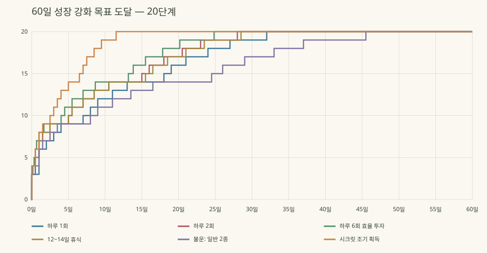
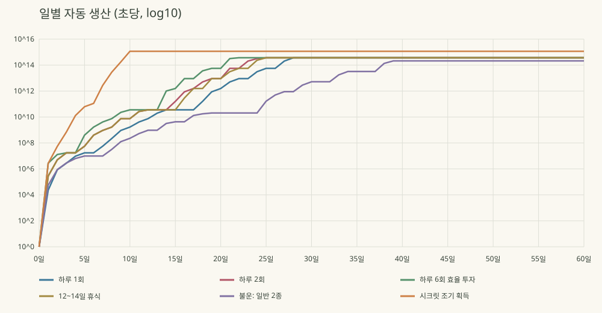

# 수치 표기·30일 성장 리워크 결과

## 실제 변경

공통 표기는 1,000배마다 K/M/B/T/Qa/Qi/Sx/Sp/Oc/No/Dc/Ud/Dd/Td/Qad/Qid/Sxd/Spd/Ocd/Nod/Vg로 올라간다. 10^66부터 과학적 지수 표기를 사용한다. 최대 소수 2자리, 0 제거, 반올림 승격을 공통 처리한다. 표시 배율 D=1이며 체력·무게·스피드에는 별도 재화 배율을 적용하지 않는다.
`src/money.ts`는 BigInt 계수와 십진 지수로 더하기·차감·곱하기·비교를 처리한다. 작은 안전 정수는 기존 number로, 큰 금액은 계산용 십진 문자열로 저장한다. 축약 표시 문자열을 원본으로 저장하지 않는다. 나눗셈은 계수 기준 소수 24자리에서 절삭하며 지갑 차감은 정확하다. 입력 지수의 자원 한도는 ±100,000이고 초과 입력은 오류로 거부한다. Infinity나 최댓값으로 바꾸지 않는다.
자동 펫 생산은 온라인/오프라인 모두 100%, 기본 48시간까지 누적된다. 구매는 접속 중에만 수행한다. 서버 생산 시계로 재접속·요청 재시도의 중복 수령을 막는다. 선택한 알의 기존 자동 타격도 복귀 때 누적하지만 수동 알 획득이나 자동 구매를 만들어 내지 않는다.
체력·훈련·자동 피해·타격 속도의 4개 중간 강화는 각각 생산 +16%를 제공한다. 스피드 강화는 기본 능력치 ×2와 다음 생산 구간을 연다. 기존 무료 스테이지 경로와 보스의 권장 스피드 판정은 유지한다. 이동 상한 20은 유지했다. 최종 경로 왕복이 약 227초여서 밤 주기를 180초에서 300초로 바꾸고 밤 강제 귀환/입구 차단은 유지했다.

## 60일 시뮬레이션

실제 `GameState`의 생산 정산·업그레이드 비용·구매 함수를 60일 실행했다. 첫 세션 20분, 이후 접속마다 10분. 기본 편성은 초반에 확보한 C/C/B 3종을 유지하는 보수적인 행동 모델이다. 획득은 온라인 60/120/180초에 발생하는 대표 결과로 모델링하며, 60일 전체 이동·실패·랜덤 획득을 물리 시뮬레이션한 것은 아니다. 이후 상위 펫 교체·수동 보상은 기본 추정에 포함하지 않으므로 적극적으로 수집하는 실제 플레이는 더 빠를 수 있다. SECRET은 기본 진행에 필요하지 않다.
재화 준비는 오프라인 생산으로 비용에 처음 도달한 시점, 구매는 접속 후 실제 `upgrade`가 성공한 시점으로 별도 저장했다. 오프라인 준비 관측 해상도는 10분, 온라인은 10초다. 강화 20개 완료와 실제 모든 스테이지 방문/수집 완료를 동일시하지 않는다. 최종 목표의 실제 왕복은 별도 검증했다.

| 유형 | 마지막 강화 준비/구매 완료 | 첫 구매 | 첫 15분 강화 구매 |
|---|---|---|---|
| 하루 1회 | 32.00일 | 80초 | 17회 |
| 하루 2회 | 28.00일 | 80초 | 17회 |
| 하루 6회 효율 투자 | 24.83일 | 80초 | 17회 |
| 12~14일 휴식 | 28.50일 | 80초 | 17회 |
| 불운: 일반 2종 | 45.50일 | 80초 | 14회 |
| 시크릿 조기 획득 | 11.50일 | 80초 | 20회 |

## 첫 세션과 최종 목표 실측

첫 확보 13.1초, 기지 보관 25.3초, 첫 부화 48.5초, 첫 구매 74.9초. 초당 4회 탭, 광고·재화 지급 없이 실제 이동/충돌/보스/밤/부화를 실행했다. 같은 일반 종만 반복 획득하는 고정 난수 조건에서 15분에 13회 구매하고 성장 3단계에 도달했다. C/C/B 대표 편성 시뮬레이션은 15분에 3개 주요 강화를 마쳤다.
최종 강화 상태에서 순간이동·무적 없이 창조자의 알까지 114.8초, 왕복·보관 227.4초. 기존 보스 추격과 실제 충돌을 포함해 손실·사망 없이 돌아와 일반 결과로 부화했다. 이는 자동 경로의 가능성 검증이며 실제 사용자 숙련도나 모바일 입력 측정은 아니다.

## 병목과 비용

5/10/15/20단계마다 네 중간 강화와 다음 스피드/최종 준비 목표를 둔다. 각 중간 비용은 기준 수익 × 구간 시간 × 조정 계수 × 0.035, 주요 비용은 × 0.78이다. 첫 스피드는 15,000이다. 기본 수익곡선은 1,000 × 10^(0.30n+0.014n²), 5→6/10→11/15→16에서 1.6배 계수를 한 번씩 더한다. 같은 단계 진입을 반복해 추가 보너스를 쌓을 수 없다. 생산 배율은 중간 강화 수와 현재 스피드 단계에서 계산한다.
| 구간 | 기준 편성 수익/초 | 주요 강화 가격 | 중간 강화 1개 가격 |
|---|---:|---:|---:|
| 1 | 1000 | 15000 | 4200 |
| 2 | 2060.63 | 385749 | 17309 |
| 3 | 4528.98 | 1907604 | 85597 |
| 4 | 10617 | 22359308 | 1003302 |
| 5 | 26546.1 | 372706620 | 16724015 |
| 6 | 113271 | 636131764 | 28544374 |
| 7 | 322196 | 3618904123 | 162386723 |
| 8 | 977507 | 32938083953 | 1477990946 |
| 9 | 3.16315e+06 | 213171100778 | 9565369906 |
| 10 | 1.09174e+07 | 2759050156535 | 123803532665 |
| 11 | 6.43043e+07 | 2166797445021 | 97228090481 |
| 12 | 2.52488e+08 | 25523461284732 | 1145283519186 |
| 13 | 1.0574e+09 | 171024981529319 | 7674197889136 |
| 14 | 4.72324e+09 | 763940530970684 | 34279382799966 |
| 15 | 2.2503e+10 | 1.06156441134047e+16 | 476343005088670 |
| 16 | 1.82962e+11 | 1.23301481030606e+16 | 553275876419384 |
| 17 | 9.91653e+11 | 1.60390830015425e+17 | 7.19702442376909e+15 |
| 18 | 5.73271e+12 | 1.3908195730806e+18 | 6.240857058695e+16 |
| 19 | 3.53476e+13 | 8.57572397252616e+18 | 3.84808126972328e+17 |
| 20 | 2.32466e+14 | 1.13581159975229e+20 | 5.09659051170899e+18 |

하루 2회 기준 가장 긴 주요 목표 구간은 20단계, 5.00일이다. 그 사이에도 네 중간 강화 구매가 가능하다. 구간별 준비·구매 시각, 구매 사이 간격, 일별 수익/지출/잔액은 [전체 원자료](../../artifacts/economy/simulation.json)에 저장했다. [최종 설정](../../artifacts/economy/settings.json)은 게임 함수에서 직접 추출했다.

## 검증과 한계

- 단위 22개 경계, 반올림 승격, 1e400 연산, 실제 금액 기준 구매 거부/차감, 저장 복원, 음수·NaN·Infinity 거부 통과.
- 서버 24시간 정산, 같은 요청 재시도, 장기 이탈 48시간 상한, 복원 후 잔액 유지 통과.
- 모바일 크기 UI에서 정확한 잔액/가격/부족액 상세와 지수 표기, 가로 넘침을 확인했다. 1.25e400 화면은 UI 검증용 재화 주입 장면이다.
- 기존 ID·보유·장착·수령 기록은 삭제하지 않는다. 경제 변경 전 고액 자산이나 높은 강화의 기존 플레이어는 신규 30일 모델을 그대로 따르지 않는다.
- 28~32일은 위 대표 편성·투자 정책의 추정치다. 불운 45.5일, 조기 시크릿 11.5일은 그 차이를 숨기지 않고 기록했다. 실제 유저의 랜덤 수집과 선택 분포를 반영한 대규모 확률 시뮬레이션·실기기 장기 테스트는 남아 있다.
- 서버 번들은 생성했지만 공개 EC2 서버의 배포는 별도 운영 작업이다. 코드/로컬 검증을 공개 서버 반영이나 실제 토스 검수로 보고하지 않는다.
