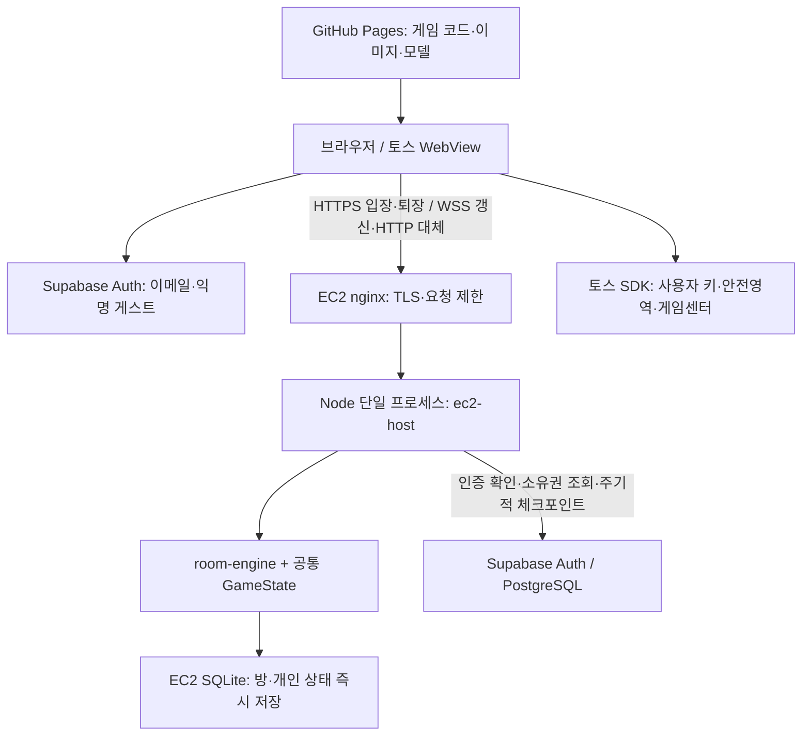

# 현재 서버 구성·의존도·수정안

작성일: 2026-10-03. **현재 저장소 코드와 마지막 운영 기록을 기준으로 정리했다. 이번 작업에서 운영 서버 접속·상태 조회·부하 테스트·배포는 수행하지 않았다.** 실제 배포본과 저장소 최신 코드가 같다고 단정하지 않는다.

이 문서의 ‘현재’ 칸은 확인된 구조이고, 마지막 ‘변경 요청’ 칸은 사용자가 원하는 방향을 적는 공간이다. 문서 수정만으로 서버 설정이나 게임 동작이 바뀌지는 않는다.

## 1. 전체 구조

핵심은 **온라인 진행과 저장의 서버 의존도가 높다**는 점이다. 화면·이동 예측·개인 보스 연출은 클라이언트가 처리하지만, 보유 데이터와 재화 변경은 게임 서버 응답을 통해 확정한다. 일반 플레이는 혼자 접속해도 온라인 방에 들어가는 구조다.

## 2. 기능별 서버 의존도

의존도는 코드 기준의 정성 분류다. CPU·트래픽 사용 비율을 측정한 수치는 아니다.

| 기능 | 현재 담당 | 서버 의존도 / 서버가 끊겼을 때 |
| --- | --- | --- |
| 게임 파일·이미지·복셀 모델 다운로드 | GitHub Pages, 클라이언트 | 처음 불러올 때 정적 호스팅 필요. 매 프레임 렌더링은 게임 서버에서 하지 않음 |
| 이메일 로그인·코드 인증·계정 연결 | Supabase Auth | 높음. 신규 로그인과 세션 갱신에 인증 서비스 필요 |
| 게스트 시작 | Supabase 익명 인증 + 게임 서버 | 높음. 로컬 오프라인 게스트가 아님. 브라우저의 인증 세션을 잃으면 게스트 기록 접근을 잃을 수 있음 |
| 방 찾기·입장·퇴장 | EC2 호스트 | 높음. 일반 플레이 진입에 서버 필요 |
| 걷기·충돌·좌표 | 클라이언트 예측 + 서버 입력 시뮬레이션 | 높음. 화면은 즉시 반응하지만 확정 좌표는 서버 상태로 보정. 연결 실패를 영구 오프라인 진행으로 전환하지 않음 |
| 공유 알 생성·획득·반납·재생성 | 서버 room-engine / GameState | 높음. 다른 사람과 소유권 충돌을 서버가 처리 |
| 개인 보스 위치·추격·접촉 감지 | 클라이언트 | 혼합. 클라이언트가 접촉을 보고하며 서버는 관련 상태와 피해·알 낙하·사망 처리를 담당 |
| 보스 피해 검증 | 서버 | 알 ID·수호자·기지·밤·은신·기상 조건 등을 확인. 서버가 보스 위치를 재현해 접촉 거리를 검증하는 구조는 아님 |
| 두드리기·자동 부화·부화 수령 | 서버 공통 게임 로직 | 높음. 진행량과 펫 지급은 서버에서 확정 |
| 별가루·강화·구매·판매·보상·쿠폰 | 서버 공통 게임 로직 | 높음. 요청에 따라 조건·소유량·재화를 계산 |
| 동행·탑승 펫·무게·능력 | 서버와 클라이언트가 같은 데이터/로직 사용 | 높음. 장착·소유는 서버 확정, 외형은 클라이언트 표시 |
| 별가루 생산·접속하지 않은 시간의 보상 | 서버의 시간·저장 상태 | 높음. 다음 접속 시 서버가 누적 시간을 계산하며 확정 |
| 낮·밤 주기·서버 시간 | 서버 시각을 클라이언트와 동기화 | 혼합. 표시·연출은 로컬, 시간과 공유 상태는 서버 기준 |
| 다른 플레이어 표시·채팅·의자·지름길 | 서버 방 상태 + 클라이언트 표시 | 높음. 방 동기화 필요 |
| 카메라·HUD·펫 모델·입자·사운드 | 클라이언트 | 낮음. 렌더링 및 UI 자체는 로컬 실행 |
| 기기별 소리 설정·로그인 세션·닉네임 기억 | 브라우저 저장소 / 플랫폼 저장 | 낮음. 온라인 소유 데이터의 최종 원본은 아님 |
| 토스 사용자 키·안전영역·진동·분석·리더보드 | src/platform.ts의 토스 SDK | 별도 플랫폼 의존. 자체 EC2 게임 계정 인증과 토스 계정의 연동 완료를 의미하지 않음 |
| 가상 광고 보상·부활 | 클라이언트 연출 + 서버 시간·조건 확인 | 온라인 처리. 실제 광고 SDK 수익화는 아님 |

근거: [진입 코드](../src/main.ts), [온라인 연결](../src/online.ts), [게임 로직](../src/game.ts), [방 명령 처리](../server/room-engine.ts), [플랫폼 어댑터](../src/platform.ts).

## 3. 서버가 처리하는 내용

### EC2 진입점

[server/ec2-host.mjs](../server/ec2-host.mjs)가 HTTP·WebSocket 연결, 인증 조회, 방 배정, 요청 제한, 로컬 저장, 클라우드 체크포인트를 담당한다.

| 경로 / 작업 | 현재 동작 |
| --- | --- |
| POST /game · join | 인증 후 프로필을 읽고 빈 방/빈 슬롯 배정 |
| POST /game · update | 이동 입력과 게임 명령 처리. WebSocket 실패 시에도 같은 호스트 사용 |
| POST /game · leave | 참가자 제거, 개인 상태 저장, 운반 알 처리 |
| WSS /game | update 요청 처리. 인증 token과 request ID, stream 버전 전달 |
| GET /healthz | 프로세스 응답 여부와 ready 값 반환 |
| GET /readyz | 소유권 활성·클라우드 확인 시각·전송 한도 등을 확인. 준비되지 않았으면 503 |

주요 게임 명령은 알 준비/획득/내려놓기, 두드리기/부화 수령, 동행/탑승/해제, 펫·알 판매, 강화·트레일 구매, 도감·주간·쿠폰 보상, 부활/가상 광고, 채팅/이름/외형/튜토리얼 등이다. 상세 조건은 [applyCommand](../server/room-engine.ts)에 있다.

### 계산 방식

- 서버에 고정 60Hz 방 전체 방송 루프가 있는 방식이 아니다. 게임 요청 시 runRoom이 방 참가자의 상태를 복원하고 경과 시간의 입력·게임 진행을 계산한다.
- 클라이언트 전송 기준은 `BALANCE.roomSyncMs=200ms`이다. 네트워크 pump는 50ms마다 확인하며 시작·정지·방향 변경·명령은 전송을 앞당길 수 있다.
- 요청당 최대 게임 명령 16개. 요청 ID·명령 ID로 재시도 중복을 처리한다.
- 클라이언트는 이동을 예측하고 응답으로 보정한다. WebSocket 연결 실패 시 HTTP를 사용하고, 실패 후 재시도 대기는 1.5초다.
- 개인 보스는 클라이언트가 시뮬레이션한다. `bossContact` 보고의 피해량을 그대로 받아들이지는 않지만 접촉 감지 자체는 클라이언트에 의존한다.
- 현재 저장소의 sections-v2는 save/fields 속성별 변경분을 전송한다. 배열이 변경되면 해당 배열 전체를 보낸다. 서버의 지원 응답 이후 사용하며 v1/전체 응답도 유지한다.

근거: [온라인 갱신](../src/online.ts), [방 엔진](../server/room-engine.ts), [변경분 프로토콜](../src/snapshot-stream.ts), [수치](../src/data.ts).

## 4. 저장과 외부 서비스

| 저장소 / 서비스 | 내용 | 의존 관계 |
| --- | --- | --- |
| EC2 메모리 | 현재 방·참가자·인증 캐시 | 단일 Node 프로세스가 방을 소유 |
| SQLite profiles | 개인 런타임/저장 상태, revision, synced | 응답 전 로컬 트랜잭션으로 기록 |
| SQLite rooms | 공유 방 상태·참가자 | 프로세스 재시작 시 읽어 복원 |
| SQLite metadata | owner, 월 전송량·월 구분 | 서버 소유권 및 전송량 제한에 사용 |
| Supabase game_profiles | 계정별 클라우드 저장 | EC2에 없는 프로필을 최초로 읽고 이후 체크포인트 |
| Supabase game_ec2_versions | 계정별 owner/revision | 오래된 재시도가 최신 진행을 덮어쓰지 않도록 처리 |
| Supabase game_backend | edge/ec2 모드와 활성 owner | 로컬 owner와 일치해야 EC2가 요청 처리 |
| Supabase Auth | 계정 UUID·세션·이메일/익명 인증 | EC2가 `/auth/v1/user`로 검증 |

SQLite 경로 기본값은 `/var/lib/egghunts/game.sqlite`다. WAL + synchronous FULL을 사용한다. 방과 참가자 상태를 원자적으로 저장하며 개인 JSON이 동일하면 revision을 늘리지 않는다.

클라우드 체크포인트는 5초마다 시도하며 한 번에 최대 100개 프로필을 전송한다. 마지막 정상 클라우드 확인이 60초 이상 오래되면 새 게임 요청을 차단한다. 로컬 디스크를 잃으면 클라우드에 반영되지 않은 진행을 잃을 수 있다. 5초 간격은 저장 지연의 보장 상한이 아니다.

DB 트리거는 EC2 활성 모드에서 옛 Edge의 쓰기를 차단한다. 따라서 EC2 장애 때 URL만 Edge로 바꾸는 자동 대체 구조는 없다. 소유권과 미반영 저장 데이터를 함께 처리해야 한다.

근거: [SQLite 저장](../server/ec2-store.mjs), [DB 소유권·체크포인트 SQL](../supabase/migrations/202609250002_ec2_backend.sql), [소유권 전환](../server/deploy/activate.mjs).

## 5. 운영 구성과 현재 제한

인스턴스 사양과 공개 주소는 2026-09-25 운영 문서의 마지막 기록이다. 아래 기본 설정은 현재 코드/배포 파일과 대조했다. 실제 `/etc/egghunts.env` 값이나 AWS 콘솔 상태는 이번에 조회하지 않았다.

| 항목 | 마지막 기록 / 저장소 기본값 | 수정 위치 |
| --- | --- | --- |
| 인스턴스 | 서울 t3.micro, Amazon Linux 2023, `i-0db140f3108b5901c` | AWS EC2 |
| 게임 주소 | `https://egghunts.54-180-115-11.sslip.io/game` | Pages workflow, nginx, DNS/TLS |
| 프런트 주소 | `https://juyounginpark.github.io/egghunts/` | Pages 설정, Auth redirect |
| 런타임 | Node 24 + ws + Node 내장 SQLite | 서버 번들·런타임 |
| 프로세스 | systemd egghunts.service, 단일 호스트 프로세스 | server/deploy/egghunts.service |
| CPU / 메모리 | CPUQuota 80%, MemoryMax 550M, V8 heap 384MB | systemd 파일 |
| 방 / 인원 | 기본 최대 4방 × 방당 5명 = 20명 상한 | GAME_MAX_ROOMS / ec2-host의 슬롯·정원 로직 |
| 게임 소켓 | 최대 maxRooms × 5 × 2; 기본 40개 | ec2-host upgrade |
| 전체 TCP | 최대 128개 | ec2-host maxConnections |
| 게임 갱신 | 기본 200ms, 명령 시 앞당김 가능 | src/data.ts / src/online.ts |
| WS 메시지 | 전역 200회/초 burst 300, IP별 100회/초 burst 150 | ec2-host message 제한 |
| 사용자 요청 | 20회/초 burst 30 | ec2-host operate |
| 인증 검증 | 최대 동시 4개, 4회/초 burst 20, 캐시 최대 10초 | ec2-host refreshIdentity |
| 입력 크기 | HTTP/WS 12,000바이트; nginx 12k | ec2-host / nginx 설정 |
| 소켓 버퍼 | 256KiB 초과 시 연결 종료 | ec2-host socketSend |
| 회원 연결 유예 | last_seen이 15초 이상 오래되면 제거 | ec2-host prune |
| 비활동 퇴장 | 일반 5분 / 운동 10분 | src/data.ts / idle-presence |
| 월 응답 payload | 기본 10,240MiB = 10GiB | GAME_MONTHLY_PAYLOAD_MB |
| 로그 | 1분 game-traffic, 월 사용량 80%/95% 경고 | ec2-host / journald |
| 압축 | WebSocket perMessageDeflate=false | ec2-host WebSocketServer |
| 자동 증설·분산 | 없음 | 별도 설계 필요 |

월 payload 제한은 게임 응답의 애플리케이션 바이트 제한이다. TLS·헤더·인증·DB·정적 에셋·OS 트래픽이나 AWS 전체 청구 상한을 뜻하지 않는다. 비용과 최대 실사용 인원은 이번에 측정하지 않았다.

2026-09-30 기록에는 월 한도 소진 직전 상태가 있었다. 현재 월의 사용량·복구 여부는 확인하지 않았다. `ready=true`여도 남은 한도보다 게임 응답이 크면 실패할 수 있다.

100~300명은 준비 목표다. 현재 4방 상한·전역 요청 제한·단일 프로세스·동기 SQLite 처리만으로 지원을 보장하지 않는다. 상세 이력은 [라이브 서비스 준비](qa/live-service-capacity.md), [EC2 이전 기록](qa/ec2-migration.md)에 있다.

## 6. 변경할 때 찾아갈 파일과 설정

| 변경하려는 내용 | 직접 수정할 위치 | 함께 고려할 부분 |
| --- | --- | --- |
| 서버에 맡길 게임 기능 | server/room-engine.ts, src/game.ts, src/online.ts | 클라이언트 명령·응답과 저장 책임 |
| 펫 능력·별가루·성장 밸런스 | src/data.ts, src/balance.ts, src/game.ts | 서버와 프런트 모두 같은 버전 적용 |
| 스테이지·보스 규칙 | src/stage-data.ts, src/game.ts, room-engine | 개인 보스 클라이언트 처리 경계 |
| 인증·게스트·이메일 연결 | src/online.ts, ec2-host, Supabase Auth 설정 | 계정 UUID와 기존 저장 연결 |
| 서버 주소 | .github/workflows/pages.yml의 VITE_GAME_SERVER_URL | nginx server_name, TLS, 허용 Origin |
| 통신 빈도·복원·예측 | src/data.ts, src/online.ts, src/snapshot-stream.ts | 요청률·대역폭·지연 |
| 방 수·전송량 | /etc/egghunts.env의 GAME_MAX_ROOMS, GAME_MONTHLY_PAYLOAD_MB | 요금·CPU·메모리·소켓 제한 |
| 방당 인원 | server/ec2-host.mjs의 정원/슬롯, 공통 UI/밸런스 | 방 수만 바꿔서는 5명 정원이 바뀌지 않음 |
| 저장·체크포인트 | ec2-store, ec2-host, Supabase migration | 로컬 내구성·owner/revision·복구 |
| CPU·메모리 제한 | server/deploy/egghunts.service | EC2 사양과 단일 프로세스 실행 |
| 요청·접속 제한 | ec2-host, server/deploy/nginx-game.conf | 동일 IP 접속·인증·HTTP/WS 경로 |
| 토스 인증·게임센터 | src/platform.ts | Supabase 계정과의 서버 연결은 별도 작업 |

서버 필수 환경 변수는 `SUPABASE_URL`, `SUPABASE_SERVICE_ROLE_KEY`, `GAME_ALLOWED_ORIGINS`다. 선택 값은 `GAME_DATA_PATH`, `GAME_MAX_ROOMS`, `GAME_MONTHLY_PAYLOAD_MB`, `HOST`, `PORT`다. 비밀키 값은 이 문서에 넣지 않는다.

프런트 환경 변수는 `VITE_GAME_SERVER_URL`, `VITE_SUPABASE_URL`, `VITE_SUPABASE_PUBLISHABLE_KEY`다. 게임 서버 URL이 비어 있으면 코드가 Supabase Edge 주소를 선택하지만, 운영 owner가 EC2인 상태에서 그것이 자동 장애 복구가 되지는 않는다. `VITE_MULTIPLAYER_URL`은 별도 기존 멀티플레이 경로용이며 OnlineGame의 권한 서버 주소와 구분한다.

main 푸시는 기존 GitHub Pages workflow의 프런트 빌드·배포를 촉발한다. EC2 서버 번들은 별도 생성·업로드·재시작이 필요하다. 이번 펫 능력 변경 역시 서버와 프런트에 같은 코드가 적용되어야 한다. 본 작업에서 서버 배포·테스트·검증 빌드는 실행하지 않았다.

## 7. 변경 요청 — 아래를 직접 수정

| 결정할 내용 | 현재 | 원하는 변경 |
| --- | --- | --- |
| 기본 플레이 연결 | 온라인 방 입장 필수 | 미정 |
| 재화·소유 데이터의 최종 책임 | 게임 서버 | 미정 |
| 개인 보스 접촉 판정 | 클라이언트 보고 + 서버 조건/피해 처리 | 미정 |
| 별가루 생산·부화 | 서버 시간과 저장 기준 | 미정 |
| 저장 방식 | SQLite 즉시 저장 + Supabase 체크포인트 | 미정 |
| 인증 | Supabase 이메일/익명 게스트 | 미정 |
| 동시접속 목표 | 희망 100~300명, 미검증 | 미정 |
| 방당 인원 / 최대 방 수 | 5명 / 기본 4방 | 미정 |
| 통신 간격 | 기본 200ms | 미정 |
| 월 비용 예산 / 응답 한도 | 예산 미정 / 기본 10GiB | 미정 |
| 서버 사양 | 마지막 기록 t3.micro | 미정 |
| 장애 때 동작 | 재시도, 방 만료 시 재입장 | 미정 |
| 운영 HTTPS 주소 | 임시 sslip.io 주소 | 미정 |

추가 요구사항:

- 변경 이유:
- 가장 먼저 바꿀 기능:
- 서버에 계속 남길 기능:
- 클라이언트로 옮길 기능:
- 저장·복구에서 유지할 조건:
- 적용 일정:
