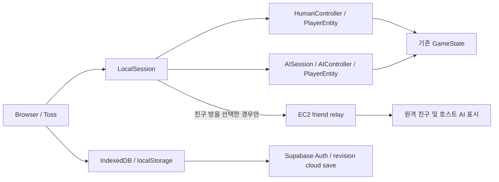

# 로컬 AI 모험가와 친구 방 전환 결과

작성일: 2026-10-03. 작업 브랜치: `refactor/local-first-presence`.
이 문서는 구현과 로컬 검증 결과다. 운영 EC2 교체, GitHub Pages main 배포, Supabase SQL 적용은 아직 하지 않았다.

## 최종 아키텍처

새 프레임워크와 dependency를 추가하지 않았다. 기존 이동, 충돌, 보스, 알, 부화, 운동, 펫 무게, 탑승, 성장과 저장 엔진을 재사용한다.

## 일반 플레이 동작

처음부터 로컬 게임과 AI 네 명을 준비한다. 서버 로그인, WebSocket, presence heartbeat는 시작하지 않는다. EC2가 없어도 이동·알·운동·전투·펫·부화·강화를 진행한다.
AI는 별도의 계정이 아니다. UI는 모험가/탐험 진행을 표시하며 AI를 실제 온라인 사용자 수로 세지 않는다. 친구 창에서 시뮬레이션 모험가임을 안내한다.

## 친구 플레이 동작

오른쪽 아래 **친구와 플레이**에서 방 만들기 또는 코드 입장을 선택한다. 연결 중에도 개인 게임은 계속된다.
실제 친구와 AI를 합쳐 다섯 슬롯을 사용한다. 실패나 서버 중단 시 로컬 동료 시뮬레이션과 저장을 유지한다. 일시 단절에는 재접속하고 서버의 메모리 방이 사라졌다면 기존 코드로 방을 다시 구성한다. 재구성 후 AI 구성은 달라질 수 있다.

## AI 구조

`PlayerEntity`가 실제 `GameState`를 가진다. HumanController와 AIController가 같은 엔진 명령을 사용하고 RemotePlayerController는 원격 표시 상태를 관리한다.
검색/접근/획득, 귀환, 운동, 휴식, 배회, 추격/공격, 도주, 대기, 퇴장을 utility 목적 행동으로 묶었다. 두드리기와 부화 수령도 기존 메서드를 호출한다. 배트 피격에는 기존 넘어짐·밀치기·알 낙하 규칙을 사용한다.

## AI Pre-Simulation 방식

30~900초의 가상 세션 나이와 이미 얻은 펫, 무게, 성장 수준, 체력, 현재 활동을 만든다. 실제로 수백 초를 실행하지 않는다.
낮에는 귀환 중인 운반자, 운동 중인 모험가, 알 탐색자, 휴식자가 서로 다른 장소에서 시작한다. 깊은 밤에는 기존 출입 규칙에 맞춰 기지의 서로 다른 활동과 농장 위치를 사용한다.
상태와 펫 자산을 준비하고 첫 장면을 렌더한 뒤 로딩 화면을 닫는다. 동시에 나타나는 spawn 애니메이션은 사용하지 않는다. 각 결정·반응·이모티콘 타이머의 위상도 다르다.

## AI Personality

공격성, 욕심, 겁, 호기심, 사교성, 숙련도, 인내심, 위험 감수 성향을 seed에서 생성한다.
상위 utility 후보를 약 70% / 22% / 8%로 선택해 매번 최적의 행동을 강제하지 않는다. 체력, 운반 알, 거리, 상대 운반 여부와 성격이 목적 선택에 영향을 준다.

## AI Human Error

숙련도에 따라 획득/공격 반응 지연, 망설임, 두 번째 목표 선택, 기회를 지나침, 짧은 대기, 경로 흔들림, 추격 포기를 적용한다.
충돌로 진행하지 못하면 잠시 다른 방향을 시도한다. 이동에는 실제 GameState 충돌과 속도·운반·탑승 배율을 사용한다.
가까운 AI는 프레임 단위, 먼 AI는 약 200ms 누적 단위로 실행하되 이동/충돌은 50ms 이하의 단계로 나눈다. 의사결정은 보통 0.3~1.5초, 휴식/운동 목적은 더 오래 유지한다.

## AI 입퇴장

기본 네 명, 자연스러운 퇴장 중 최소 두 명을 유지한다. 처음 45초는 자연 입퇴장을 막는다.
일반 세션은 3~8분이 흔하고 짧은 세션/긴 세션도 섞는다. 행동 종료와 안전 지점 이동 뒤 퇴장하거나 지연 상한에 도달하면 정리한다.
새 입장은 12~37초 이상의 간격을 두며 고정 농장 입구/지도 입구 후보 중 화면 밖의 위치를 고른다. 플레이어 주변으로 순간 이동시키지 않는다. 깊은 밤에는 기지 밖에 새로 배치하지 않는다.

## AI 펫 생성

현재 진행 범위의 기존 펫 카탈로그를 사용한다. 1~3마리 동료와 일부 탑승 구성을 섞는다.
실제 `rollEggWeight`, pet lot, 장착, 부화·생산·탑승 배율을 재사용한다. AI 전용 가짜 능력치를 만들지 않는다.
인계에는 장착 lot의 실제 무게와 부화 대기 알을 포함한다. 사용하지 않는 AI 수집품 전체를 영구 저장하거나 계속 전송하지 않는다.

## 이모티콘 시스템

👋 안녕 / ❤️ 좋아! / 😄 웃음 / 😠 화남 / 😮 놀람 / 🚀 가자! 여섯 개다.
사람과 AI가 같은 emote 값과 머리 위 표시를 사용하고 약 2.5초 뒤 숨긴다. AI는 성격과 상황별 확률, 10~30초 cooldown을 적용한다. 반복 위치 패킷이 표시 시간을 계속 연장하지 않도록 처리했다.

## 제거한 채팅 기능

`src/room-chat.ts`를 삭제했다. 입력·로그·말풍선 텍스트·채팅 CSS·아이콘·타입·밸런스 상수를 제거했다.
현재 친구 서버는 chat 패킷을 거절한다. deprecated authoritative room-engine과 online snapshot에서도 채팅 명령과 필드를 제거했다.

## Room Code

혼동되는 I/O/0/1을 제외한 문자와 숫자로 다섯 자리 코드를 발급한다. 같은 코드를 입력한 친구만 해당 방으로 입장한다.
활성 코드 충돌을 검사하고 방/접속/패킷 크기/요청 빈도를 제한한다. 코드는 초대 수단이며 결제나 경쟁 권한을 증명하는 인증 수단이 아니다.

## AI 슬롯 교체

실제 친구가 들어오면 해당 슬롯의 AI에 약 1.5초의 퇴장 시간을 준다. 슬롯을 예약하므로 동시 입장 요청도 서로 다른 자리를 사용한다.
이후 서버가 슬롯을 확정하고 AI를 제거한다. 실제 사람 다섯 명일 때만 정원 초과로 입장을 거절한다.

## AI Host Migration

첫 실제 플레이어가 AI 호스트다. 다른 클라이언트는 호스트 AI 표시만 보간한다.
호스트가 나가거나 background 상태가 되면 다른 실제 플레이어에게 epoch와 체크포인트를 전달한다. AI 갱신이 8초 이상 멈춘 경우에도 다른 활성 친구로 넘긴다.
체크포인트는 보통 5초 간격, 구성/운반 상태 변경 시에도 전송한다. identity, seed/random state, 위치·회전·체력, 활동·목표, 운반 알, 상대 타이머, 성장·장착·부화 대기 상태를 담는다. 캐시한 위치는 더 최신 중계 위치로 갱신한다. 전체 플레이어 GameState/일반 월드/보스 배열은 보내지 않는다.
갑작스러운 종료에서는 마지막 체크포인트 이후의 작은 AI 내부 상태 차이가 남을 수 있다. 개인 사용자 저장은 이 인계와 무관하다.

## 서버에 남은 기능

방 코드, 최대 다섯 슬롯의 입퇴장/presence, human/AI 표시 상태, 위치/회전/애니메이션, 배트 이벤트, 떨어진 알의 단일 획득 중계, 이모티콘, AI 호스트 지정·인계, 연결 lease/느린 수신자 제한을 처리한다.
상태는 메모리다. AI GameState, 물리 시뮬레이션, 개인 부화/재화/진행 저장과 SQLite 쓰기는 없다. 공유 이벤트 게시/검증은 별도의 서버 확장 지점이며 상시 월드 이벤트를 새로 구현하지 않았다.

## 로컬로 이동한 기능

일반 게임 전부와 AI 의사결정·이동·충돌·알·운동·개인 보스·부화·펫·성장, 개인 재화·단계 진행을 로컬에서 처리한다.
사람/AI 사이의 로컬 알 약탈은 같은 배트와 pickup 로직을 사용하며 한 번만 전달한다. 친구 방의 떨어진 알은 서버가 claim을 한 번만 중계한다.
실제 결제·광고·쿠폰·랭킹의 기존 SecureEconomy 검증 경계를 유지한다. 검증 provider가 없다고 일반 로컬 보상으로 대체하지 않는다.

## 변경된 파일

- `src/main.ts`, `src/world.ts`, `src/room-hud.ts`, `src/guardian-motion.ts`, `src/style.css`
- `src/data.ts`, `src/multiplayer.ts`, `src/online.ts`, `src/presence-client.ts`, `src/presence-config.ts`, `src/ui-icons.ts`
- `server/presence-host.mjs`, `server/presence-room.mjs`, `server/room-engine.ts`
- `package.json`, `scripts/qa/local-first.mjs`, `scripts/qa/local-first-ui.mjs`
- `alkong-expedition-game-spec.md`, `docs/qa/implementation-plan.md`

## 신규 파일

- `src/player-entity.ts`: 공통 actor와 human/remote controller
- `src/ai-session.ts`: 성격, seed, utility, 실수, presimulation, 세션/인계
- `src/local-session.ts`: 로컬/친구 모드, 공통 전투와 알 전달
- `src/emotes.ts`: 공통 여섯 이모티콘
- `src/friends-ui.ts`: 친구 방/코드/이모티콘 UI
- `scripts/qa/simulated-players.mjs`: AI·동시 입장·중계 검증
- `docs/simulated-players-architecture.md`: 이 결과 문서

## 테스트 결과

| 명령/검증 | 결과 |
|---|---|
| `npm run build` | TypeScript와 Vite production 빌드 통과 |
| `npm run qa:typecheck` | 통과 |
| `npm run qa:lint` | 통과 |
| `node scripts/build-ec2.mjs` | 경량 서버 번들 생성 통과 |
| `node scripts/qa/local-first.mjs` | 저장·migration·오프라인·CAS·보안 경계 9개 통과 |
| `node scripts/qa/simulated-players.mjs` | 초기 상태, 5분 시뮬레이션, 공격/약탈, 입퇴장, 호스트 인계, 동시 입장 등 10개 검사 |
| `node scripts/qa/local-first-ui.mjs` | 실제 브라우저 로컬 실행·새로고침·친구 코드·보간/이모티콘·호스트 인계·서버 장애/복구·클라우드 fixture 6개 통과 |
| `node scripts/qa/balance.mjs` | 통과 |
| `node scripts/qa/multiplayer.mjs` | legacy 서버 통합 11개 통과 |
| `npm run qa:unit` | 기존 가방 용량 기대값에서 실패 |
| 개별 `scripts/qa/unit.mjs` | 기존 삭제된 tickDamage 호출에서 실패 |
| 개별 `scripts/qa/progression.mjs` | 기존 100~495 HP 기대값과 현재 두 칸 체력 규칙 차이로 실패 |

기존 세 실패는 앞선 작업의 변경 전 HEAD 재현 기록 `artifacts/test-results/local-first-baseline.json`과 동일하다. 테스트 삭제나 기준 완화로 숨기지 않았다.
5분 검사는 게임 시간을 누적한 자동 시뮬레이션이다. 실제 사용자가 5분 플레이하며 느끼는 자연스러움과 토스 실기기 FPS를 검증했다고 보고하지 않는다. 클라우드는 RPC fixture로 확인했으며 운영 Supabase SQL 적용 확인과 구분한다.
사용자 데이터 Save v1/profile migration 경로는 유지한다. AI를 사용자 Save에 넣지 않는다. 기존 EC2/SQLite/Supabase 데이터는 운영 전환 전에 백업·수입해야 한다.

## 서버 트래픽 감소 요소

일반 플레이의 EC2 실시간 연결은 **0개**다. 로컬 AI 네 명도 서버 패킷을 발생시키지 않는다.
친구 방에서만 human/호스트 AI의 약 500ms 표시 변경분을 중계한다. 이동 시작/정지·탑승·텔레포트·이모티콘은 더 빠르게 전달할 수 있으며, 전체 인벤토리/펫 소유 목록/진행도/재화/일반 알 월드를 매 위치 패킷으로 보내지 않는다.
따라서 전체 이용자보다 **친구 방에 실제로 연결된 사람 수**가 EC2 부하를 좌우한다. 감소 비율과 100~300명 수용 가능 여부는 운영 부하 테스트 없이 확정하지 않는다.

## 남은 문제

2026-10-03 운영 EC2를 친구 방 중계 서버로 전환했고 Supabase local-first migration을 적용했다. SQLite 56개 기록 중 유효 계정 54개를 클라우드로 이전하고 삭제 계정 2개는 백업에 보존했다. 공개 페이지 전환 기록은 [배포 기록](deployments/2026-10-03-local-first.md)을 따른다.
실제 토스 인증/광고/리더보드 검증 provider는 미연결이며 이번 변경으로 구현됐다고 보고하지 않는다.
로컬 게임과 클라이언트 AI 호스트를 신뢰하므로 재화·행동·위치 조작을 완전히 막지 못한다. 공유 알 중계의 소유권/크기/거리 검사는 실제 결제나 랭킹 검증을 대신하지 않는다.
AI 인계에는 현재 장착·진행에 필요한 상태를 보관하며 모든 과거 수집품/개인 보스 이력까지 복제하지 않는다. 서버 재시작 뒤 AI 세션이 완전히 동일하게 복구되지는 않는다.

## 추가 개선 후보

토스 실제 기기의 체감/프레임과 5분 이상 플레이를 확인하고 성격별 공격 빈도·입퇴장·동선 밸런스를 조정한다.
선택 차원이 다른 친구의 지도 표시 규칙, 장시간 AI 이력 유지, 안전한 펫 자산 캐시 및 렌더 LOD를 개선할 수 있다.
월간 전송량/CPU/접속 수를 계속 계측한다. 기존 월 10GiB payload 정책은 SQLite metadata의 사용량을 별도 JSON 계량 파일로 이전해 중계 서버에도 연결했다. 이는 AWS 청구 전체에 대한 상한이 아니다.
